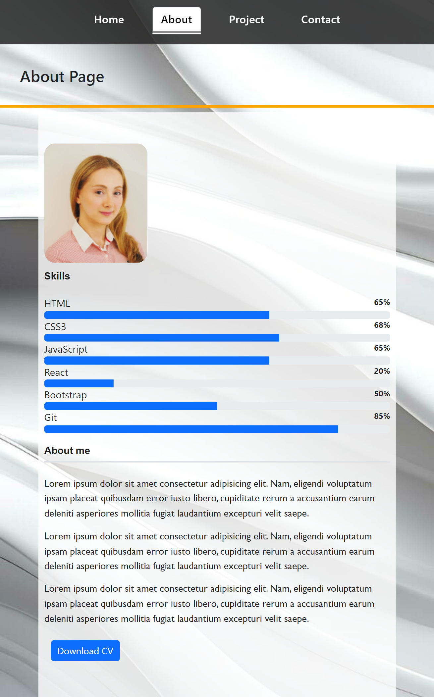
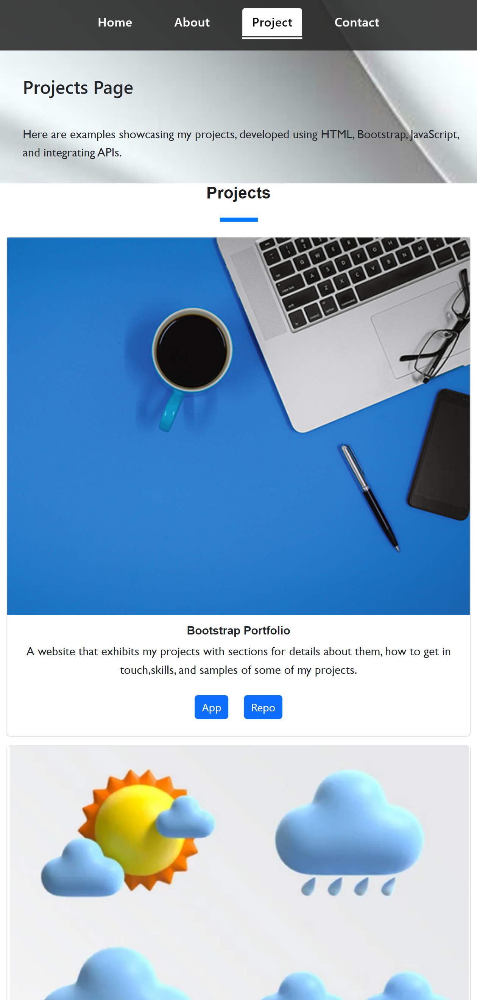

# React Portfolio

## Table of Contents
- [Description](#description)
- [React Portfolio](#react-portfolio)
  - [Screenshots](#screenshots)
  - [GitHub](#github)
  - [License](#license)
 

## React Portfolio

### Description
The React-based portfolio offers a comprehensive view of my professional profile. Explore my CV, contact information, and a curated collection of projects, each with its own link for further details. With a minimalist design and seamless navigation, this portfolio is designed to showcase my skills and expertise effectively. Use it to learn more about my background, explore my work, and get in touch for potential opportunities.

### Screenshots

### Deployed Link
React-Portfolio: **[link to application](https://main--classy-meerkat-07e0fc.netlify.app/)**

### GitHub
GitHub: **[Nukte-Y](https://github.com/Nukte-y/ReactPortfolio)**

### License
This project is licensed under the terms of the [MIT License](LICENSE).

